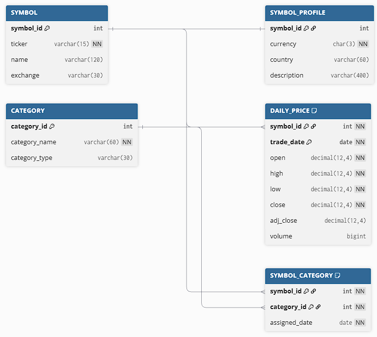

# cop-3701-stock-market-time-series-db
A financial database project that stores and analyzes historical stock market time-series data by using MySQL and Oracle, including prices, volume, and basic analytics such as moving averages.

## Application Domain
This project falls under the financial data management domain, as it focuses on working with an existing stock market dataset provided through Kaggle. The application utilizes a structured database to store historical stock prices and trading volume data, supporting basic time-series queries and analysis. The project focuses on organizing, querying, and analyzing the financial data.

The Database is implemented in both MySQL and Oracle to compare how each system handles data types, indexing, and query executions.

## Database Application Description
The proposed database stores:
- Stock symbols (tickers and exchange information)
- Daily price records for each symbol
- Category classifications (Stocks & ETF)
- Symbol profile metadata (currency, country, description)

The ER design includes:
- Strong entities (SYMBOL, CATEGORY)
- A weak entity (DAILY_PRICE, dependent on SYMBOL)
- An associative entity (SYMBOL_CATEGORY)
- One-to-one, one-to-many, and many-to-many relationships

## ER Diagram


## Goals
The goal of this project is to build a well-structured database using the existing Kaggle stock market dataset. This project focuses on understanding core database concepts using a real-world financial dataset.

- **Load existing dataset into a database**
  Import the financial Kaggle CSV file into Oracle and MySQL.
- **Understand basic table structure**
  Learn how tables, rows, and columns are used to store stock market data.
- **Practice writing simple SQL queries**
  Retrieve stock prices and volumes using queries.
- **Work with data-based data**
  Query stock data by date or date ranges to understand time-series information
- **Perform basic analytical queries using SQL**
  Calculate moving averages, daily price changes, partitions by date, optimized index strategies, and simple volatility metrics.
- **Compare behavior across database systems**
  Observe the differences in how the two databases handled data.

## Unique / Challenging Aspects
- Handling large historical time-series datasets efficiently
- Designing a composite primary key for daily stock records
- Implementing a weak entity structure correctly
- Creating many-to-many relationships using associative entities
- Managing the different SQL syntax and data types between Oracle and MySQL

## Project Scope
The scope of this project is limited to working with an existing stock market dataset that is provided through Kaggle. The project will focus on importing and building the dataset, organizing it into tables, and running SQL queries to get information. This project will also be limited by not including real-time updates, financial modeling, and prediction systems. As the project goal is to keep the scope small and manageable while learning database concepts, and learning about the stock market.

## Intended Users
The intended users are:
- Students' learning database
- Faculty demonstrating ER modeling and SQL
- Individuals interested in basic stock market data

## Data Sources
The data used in this project is from a pre-existing Kaggle dataset containing historical stock market information. The dataset provides stocks, etf, and symbols, which help include attributes such as stock prices, trading volumes, and dates.


## Database Setup from Scratch

This section is for anyone who wants to recreate the database from the beginning.

### 1. Download the Dataset

Download the stock market dataset from Kaggle and place the raw files in the project folder.

The project expects:
- `stocks/`
- `etfs/`
- `symbols_valid_meta.csv`

### 2. Create the Database Tables

Connect to Oracle using SQL Developer or another SQL tool.

Run the SQL schema below to create the database tables:

```sql
DROP TABLE symbol_category CASCADE CONSTRAINTS;
DROP TABLE daily_price CASCADE CONSTRAINTS;
DROP TABLE symbol_profile CASCADE CONSTRAINTS;
DROP TABLE category CASCADE CONSTRAINTS;
DROP TABLE symbol CASCADE CONSTRAINTS;

CREATE TABLE symbol (
   symbol_id NUMBER PRIMARY KEY,
   ticker    VARCHAR2(15) NOT NULL UNIQUE,
   name      VARCHAR2(255),
   exchange  VARCHAR2(30)
);

CREATE TABLE symbol_profile (
   symbol_id   NUMBER PRIMARY KEY,
   currency    CHAR(3) NOT NULL,
   country     VARCHAR2(60) NOT NULL,
   description VARCHAR2(400),
   CONSTRAINT fk_symbol_profile 
      FOREIGN KEY (symbol_id)
      REFERENCES symbol (symbol_id)
);

CREATE TABLE category (
   category_id   NUMBER PRIMARY KEY,
   category_name VARCHAR2(60) NOT NULL,
   category_type VARCHAR2(30)
);

CREATE TABLE daily_price (
   symbol_id  NUMBER,
   trade_date DATE,
   open       NUMBER(12,4) NOT NULL,
   high       NUMBER(12,4) NOT NULL,
   low        NUMBER(12,4) NOT NULL,
   close      NUMBER(12,4) NOT NULL,
   adj_close  NUMBER(12,4),
   volume     NUMBER,
   CONSTRAINT pk_daily_price 
      PRIMARY KEY (symbol_id, trade_date),
   CONSTRAINT fk_daily_price_symbol 
      FOREIGN KEY (symbol_id)
      REFERENCES symbol (symbol_id)
);

CREATE TABLE symbol_category (
   symbol_id     NUMBER,
   category_id   NUMBER,
   assigned_date DATE NOT NULL,
   CONSTRAINT pk_symbol_category 
      PRIMARY KEY (symbol_id, category_id),
   CONSTRAINT fk_symbol_category_symbol 
      FOREIGN KEY (symbol_id)
      REFERENCES symbol (symbol_id),
   CONSTRAINT fk_symbol_category_category 
      FOREIGN KEY (category_id)
      REFERENCES category (category_id)
);

COMMIT;
```

### 3. Preprocess the Data

Run:

```bash
python preprocess.py
```

This creates cleaned CSV files inside the `data/` folder:
- `symbol.csv`
- `symbol_profile.csv`
- `category.csv`
- `symbol_category.csv`
- `daily_price.csv`

### 4. Load the Data

Run:

```bash
python dataload.py
```

This inserts the cleaned CSV data into the Oracle database tables.

### 5. Verify the Tables

After loading the data, run:

```sql
SELECT COUNT(*) FROM SYMBOL;
SELECT COUNT(*) FROM CATEGORY;
SELECT COUNT(*) FROM SYMBOL_PROFILE;
SELECT COUNT(*) FROM SYMBOL_CATEGORY;
SELECT COUNT(*) FROM DAILY_PRICE;
```

These queries confirm that data was inserted into each table.

### 6. Run the Application

Run:

```bash
python app/app.py
```

The application connects to the database and allows users to run prepared reports on the stock data.